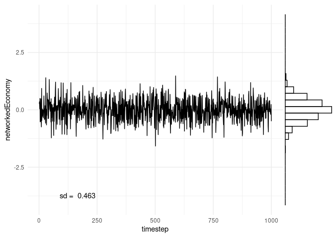

German-ShockSimulation
================

Domar weights v are calculated as $v = (I-(1-)W)^{-1} $

with *α* = 0.3333 (choice in Acemoglu(2012)).

Acemoglu (2017) calculate Domar weights of a networked economy in two
different ways. One is with sales data, dividing industries sales over
GDP. This is an empirical Domar weight. The other way is as in the above
equation. Instead of a normalised matrix W which is multiplied by
(1 − *α*) &lt; 1, the technical coefficient matrix is used to calculate
the Domar weight (This is in effect very close to using the normalised
matrix).

### 1 Laplacian (double exponential) shocks

All time series are plotted on the same interval of the y-axis to
illustrate how volatile aggregate output in different economies is in
comparison to shocks. As expected from the analytic statements,
volatility is smoothed strongest in the homogeneous economy. Volatility
doesn’t vanish so fast in the networked economy.

    ## [1] "ggplot(data= shocked_Economies$shock_output , aes(timestep, networkedEconomy)) + geom_line() + \n  geom_vridgeline(data = res.select, aes(group = time, width = ..density..), \n                  stat = \"ydensity\", scale = 5000, fill = NA, color = \"blue\", size = 1) "

<!-- -->

    ## [1] "p2 <- ggplot(data=d1, aes(timestep, out_agg)) + geom_point(alpha=0) + geom_line() + theme_minimal() + annotate(\"text\", x = 90, y = -3.7, label =  paste(\"sd = \", round(sd(out_agg), digits = 3))) # suppress points, only show lines\nggMarginal(p2, margins=\"y\", type = \"histogram\", fill=NA)"

    ## [1] "c1 <- rgb(169, 169, 169, max = 255, alpha = 10)\nhist(out_agg, breaks = 1000, xlim = c(-15,15), col = c1)\npar(new=TRUE)\nplot(dnorm(x, mean = mean(out_agg), sd=sd(out_agg)), type = \"l\", col=\"green\")"

<!-- -->
Volatility of aggregate output in networked economy has decreased
compared to shocks but is higher than in homogenous economy. Due to the
law of large numbers, the more disaggregated the economy gets
(n\_sectors –&gt; ∞) the lower should be the volatility. With more
sectors, the aggregate output time series will center narrower and
narrower around the mean.

<!-- -->

#### 1.1 Q-Q plots aggregate output US network economy and shocks

With too low shock sample size aggregate output appears to be less
normal distributed than shocks.

As expected from the analytical results, aggregate output of the
networked economy deviates more from the normal distribution in the
tails than aggregate output of the homogeneous economy.

#### 1.2 Q-Q plots aggregate output homogenous economy and shocks

\#\#\# 2 Normal shocks

    ## [1] "ggplot(data= shocked_Economies$shock_output , aes(timestep, networkedEconomy)) + geom_line() + \n  geom_vridgeline(data = res.select, aes(group = time, width = ..density..), \n                  stat = \"ydensity\", scale = 5000, fill = NA, color = \"blue\", size = 1) "

<!-- -->

    ## [1] "p2 <- ggplot(data=d1, aes(timestep, out_agg)) + geom_point(alpha=0) + geom_line() + theme_minimal() + annotate(\"text\", x = 90, y = -3.7, label =  paste(\"sd = \", round(sd(out_agg), digits = 3))) # suppress points, only show lines\nggMarginal(p2, margins=\"y\", type = \"histogram\", fill=NA)"

    ## [1] "c1 <- rgb(169, 169, 169, max = 255, alpha = 10)\nhist(out_agg, breaks = 1000, xlim = c(-15,15), col = c1)\npar(new=TRUE)\nplot(dnorm(x, mean = mean(out_agg), sd=sd(out_agg)), type = \"l\", col=\"green\")"

<!-- -->

<!-- -->

#### 2.1 Q-Q plots aggregate output network economy and normal shocks

#### 2.2 Q-Q plots aggregate output homogeneous economy and normal shocks

