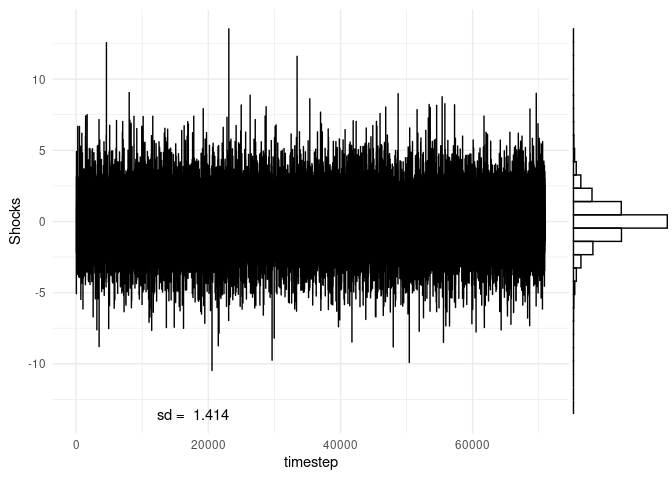
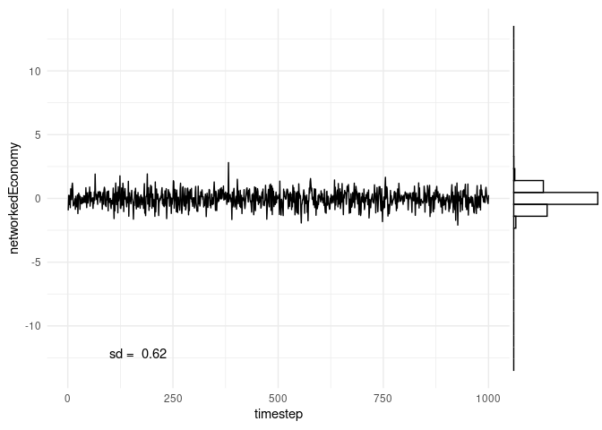
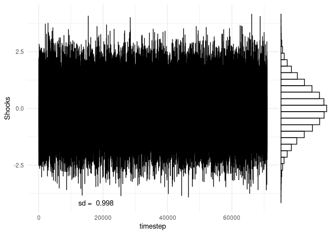
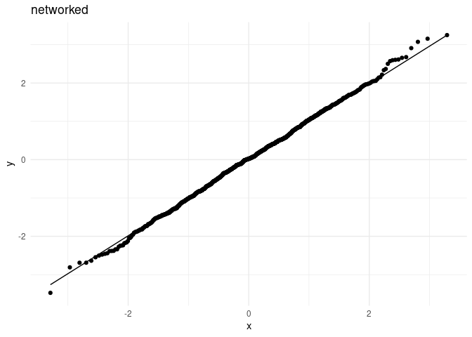

German-ShockSimulation
================

Influence vectors v are calculated as
*v* = (1/*n*)(*I* − (1 − *α*)*W*) − 1**1** with *α* = 0.3333
(choice in Acemoglu(2012)).

Acemoglu (2017) calculate Domar weights of a networked economy in two
different ways. One is with sales data, dividing industries sales over
GDP. This is an empirical Domar weight. The other way is as in the above
equation.

### 1 Laplacian (double exponential) shocks

All time series are plotted on the same interval of the y-axis to
illustrate how volatile aggregate output in different economies is in
comparison to shocks. As expected from the analytic statements,
volatility is smoothed strongest in the homogeneous economy. Volatility
doesn’t vanish so fast in the networked economy.

<!-- -->

<!-- -->

The standard deviation predicted by the analytical results is 0.1677736.

Volatility of aggregate output in networked economy has decreased
compared to shocks but is higher than in homogenous economy. Due to the
law of large numbers, the more disaggregated the economy gets
(n\_sectors –&gt; ∞) the lower should be the volatility. With more
sectors, the aggregate output time series will center narrower and
narrower around the mean.

<!-- -->

The standard deviation predicted by the analytical results with the
influence vector v is 0.6425023.

<!-- -->
The standard deviation of aggregate output is even larger than the
standard deviation of shocks when the influence vector is the sum of
output shares and output multipliers.

#### 1.1 Q-Q plots aggregate output and laplacian shocks

With too low shock sample size aggregate output appears to be less
normal distributed than shocks.

As expected from the analytical results, aggregate output of the
networked economy deviates more from the normal distribution in the
tails than aggregate output of the homogeneous economy.

### 2 Normal shocks

    ## [1] "ggplot(data= shocked_Economies$shock_output , aes(timestep, networkedEconomy)) + geom_line() + \n  geom_vridgeline(data = res.select, aes(group = time, width = ..density..), \n                  stat = \"ydensity\", scale = 5000, fill = NA, color = \"blue\", size = 1) "

<!-- -->

<!-- -->

The standard deviation predicted by the analytical results is 0.1184706.

<!-- -->

Using the lower bound approximation of the influence vector v, only
including the direct and first order effects, the predicted standard
deviation is . And for the influence vector v with all higher order
effects: 0.4536927.

<!-- -->

#### 2.1 Q-Q plots aggregate output and normal shocks

    ## # A tibble: 2 × 5
    ##   shockdistr shocks homogeneous networked heterogeneousnetworked
    ##   <chr>       <dbl>       <dbl>     <dbl>                  <dbl>
    ## 1 normal      0.998       0.118     0.454                   1.06
    ## 2 laplace     1.41        0.168     0.643                   1.51

    % latex table generated in R 4.1.2 by xtable 1.8-4 package
    % Sun Jan 23 14:19:01 2022
    \begin{table}[ht]
    \centering
    \begin{tabular}{rlrrrr}
      \hline
     & shockdistr & shocks & homogeneous & networked & heterogeneousnetworked \\ 
      \hline
    1 & normal & 1.00 & 0.12 & 0.45 & 1.06 \\ 
      2 & laplace & 1.41 & 0.17 & 0.64 & 1.51 \\ 
       \hline
    \end{tabular}
    \end{table}

#### 3. influence vector v CCDF

<!-- -->

Calculate the statistic delta indicating tail risk.

    ## [1] 1

    ## [1] 3.371985

    ## [1] 6.098964

    ## % latex table generated in R 4.1.2 by xtable 1.8-4 package
    ## % Sun Jan 23 14:19:01 2022
    ## \begin{table}[ht]
    ## \centering
    ## \begin{tabular}{rrrr}
    ##   \hline
    ##  & homogeneous & networked & heterogeneousnetworked \\ 
    ##   \hline
    ## 1 & 1.00 & 3.37 & 6.10 \\ 
    ##    \hline
    ## \end{tabular}
    ## \end{table}
