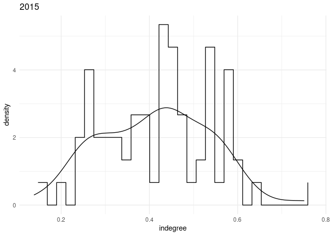
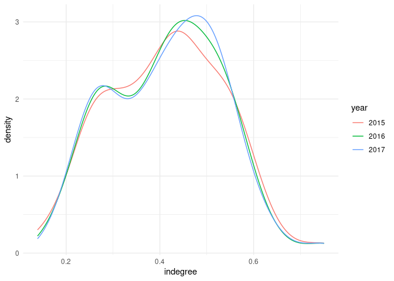

German Indegrees
================

## Indegree statistics

### Empirical PDF of first order weighted indegree

    ##      sapply.In..min. sapply.In..mean. sapply.In..max.
    ## 2015       0.1388695        0.4129628       0.7502808
    ## 2016       0.1788421        0.4143692       0.7495505
    ## 2017       0.1958489        0.4147837       0.7481957

    ##   sapply.A_matrix..min. sapply.A_matrix..mean. sapply.A_matrix..max.
    ## 1                     0            0.005816378             0.5392620
    ## 2                     0            0.005836187             0.5234157
    ## 3                     0            0.005842024             0.5330748

Entries in the technical coefficient matrix A of 2015 are in the range
\[0, 0.539262\]. Range for Acemoglus matrix A of 2002: \[0, 0.6387209\].

    ##      sapply.A..zeros. sapply.A..relzeros.
    ## 2015             1584           0.3142234
    ## 2016             1595           0.3164055
    ## 2017             1586           0.3146201

    ## [1] 5041

    ## [1] TRUE

    ##   sapply.A_matrix..nrselfloops. sapply.A_matrix..meanselfloops.
    ## 1                             4                       0.1067009
    ## 2                             4                       0.1044650
    ## 3                             4                       0.1072722
    ##   sapply.A_matrix..maxselfloops.
    ## 1                      0.5392620
    ## 2                      0.5234157
    ## 3                      0.5330748

    ## [1] 67
