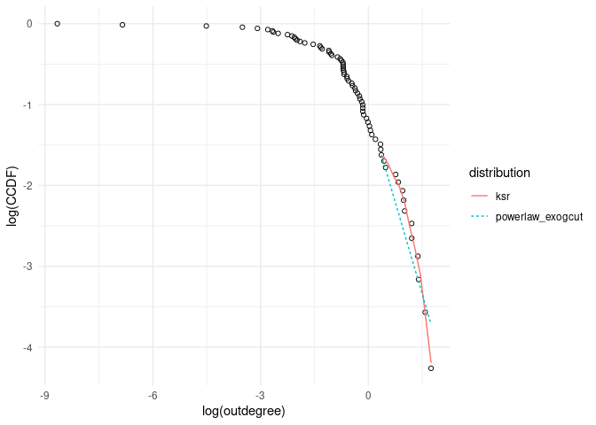

German second order outdegrees
================

Year: 2015, 2016, 2017

 

### Fitted distributions parameters

The following table contains the estimated slope of the tail with
different models. The standard error of the two linear regressions
differ so much because the corrected regression also uses an upward
corrected standard error. Also the p-value of a goodness-of-fit test via
bootstrapping for the powerlaw is reported. A high p-value indicates
that the distribution is a good fit to to the data.

The estimated slopes are much steeper here than for the US outdegree
distribution. Only the power law estimated with optimal tail length has
a slope that is not so steep (1.61).

    ## # A tibble: 15 × 6
    ##    year  distribution     parameter  xmin stderror p_value
    ##    <chr> <chr>                <dbl> <dbl>    <dbl>   <dbl>
    ##  1 2015  lm                    1.71    14    0.177   NA   
    ##  2 2016  lm                    1.73    14    0.177   NA   
    ##  3 2017  lm                    1.69    14    0.180   NA   
    ##  4 2015  lm_GIcorrect          2.01    14    0.761   NA   
    ##  5 2016  lm_GIcorrect          2.03    14    0.767   NA   
    ##  6 2017  lm_GIcorrect          1.99    14    0.750   NA   
    ##  7 2015  ksr                   1.92    14   NA       NA   
    ##  8 2016  ksr                   1.94    14   NA       NA   
    ##  9 2017  ksr                   1.96    14   NA       NA   
    ## 10 2015  powerlaw              1.17    45   NA        0.37
    ## 11 2016  powerlaw              1.15    42   NA        0.54
    ## 12 2017  powerlaw              1.15    44   NA        0.1 
    ## 13 2015  powerlaw_exogcut      1.51    14   NA        0.79
    ## 14 2016  powerlaw_exogcut      1.52    14   NA        0.87
    ## 15 2017  powerlaw_exogcut      1.51    14   NA        0.4

    % latex table generated in R 4.1.2 by xtable 1.8-4 package
    % Sun Jan 23 13:17:36 2022
    \begin{table}[ht]
    \centering
    \begin{tabular}{rllrrrr}
      \hline
     & year & distribution & parameter & xmin & stderror & p\_value \\ 
      \hline
    1 & 2015 & lm & 1.71 & 14.00 & 0.18 &  \\ 
      2 & 2016 & lm & 1.73 & 14.00 & 0.18 &  \\ 
      3 & 2017 & lm & 1.69 & 14.00 & 0.18 &  \\ 
      4 & 2015 & lm\_GIcorrect & 2.01 & 14.00 & 0.76 &  \\ 
      5 & 2016 & lm\_GIcorrect & 2.03 & 14.00 & 0.77 &  \\ 
      6 & 2017 & lm\_GIcorrect & 1.99 & 14.00 & 0.75 &  \\ 
      7 & 2015 & ksr & 1.92 & 14.00 &  &  \\ 
      8 & 2016 & ksr & 1.94 & 14.00 &  &  \\ 
      9 & 2017 & ksr & 1.96 & 14.00 &  &  \\ 
      10 & 2015 & powerlaw & 1.17 & 45.00 &  & 0.37 \\ 
      11 & 2016 & powerlaw & 1.15 & 42.00 &  & 0.54 \\ 
      12 & 2017 & powerlaw & 1.15 & 44.00 &  & 0.10 \\ 
      13 & 2015 & powerlaw\_exogcut & 1.51 & 14.00 &  & 0.79 \\ 
      14 & 2016 & powerlaw\_exogcut & 1.52 & 14.00 &  & 0.87 \\ 
      15 & 2017 & powerlaw\_exogcut & 1.51 & 14.00 &  & 0.40 \\ 
       \hline
    \end{tabular}
    \end{table}

 

### Comparing GoF of alternative distributions to power law

P-values of the one sided likelihood ratio tests. The powerlaw of 2
different tail lengths is compared to the lognormal, weibull and
exponential distribution (each estimated with the tail length
corresponding to the powerlaw they are compared to). The p-value is the
probability of having the test statistic tending to one distribution if
actually the other distribution is a better fit. Thus the high p-values
for lognormal and weibull indicates that the tendency of the test
statistic to one distribution is not significant.

For the German data also the p-value for the exponential distribution is
very high, therefore it can not be concluded that the powerlaw is a
significantly better fit.

    ## # A tibble: 2 × 4
    ##   distribution     lognormal weibull exponential
    ##   <chr>                <dbl>   <dbl>       <dbl>
    ## 1 powerlaw             0.746   0.769       0.262
    ## 2 powerlaw_exogcut     0.719   0.796       0.927

    ## [1] 0.6382221

    ## [1] -1.456391

    ## % latex table generated in R 4.1.2 by xtable 1.8-4 package
    ## % Sun Jan 23 13:17:36 2022
    ## \begin{table}[ht]
    ## \centering
    ## \begin{tabular}{rlrrr}
    ##   \hline
    ##  & distribution & lognormal & weibull & exponential \\ 
    ##   \hline
    ## 1 & powerlaw & 0.75 & 0.77 & 0.26 \\ 
    ##   2 & powerlaw\_exogcut & 0.72 & 0.80 & 0.93 \\ 
    ##    \hline
    ## \end{tabular}
    ## \end{table}

P-values of two sided likelihood ratio tests. The p-values are the
probability of getting a positive or negative test statistic with this
value if actually no distribution fits better. The p-values for
lognormal and weibull are large, therefore the test can not distinguish
whether the power law or these distributions fit better.

The p-value for the exponential distribution is quite high here, thus it
can not be concluded that one of the two distributions fits better.

    ## # A tibble: 2 × 4
    ##   distribution     lognormal weibull exponential
    ##   <chr>                <dbl>   <dbl>       <dbl>
    ## 1 powerlaw             0.508   0.462       0.523
    ## 2 powerlaw_exogcut     0.563   0.408       0.145

    ## % latex table generated in R 4.1.2 by xtable 1.8-4 package
    ## % Sun Jan 23 13:17:36 2022
    ## \begin{table}[ht]
    ## \centering
    ## \begin{tabular}{rlrrr}
    ##   \hline
    ##  & distribution & lognormal & weibull & exponential \\ 
    ##   \hline
    ## 1 & powerlaw & 0.51 & 0.46 & 0.52 \\ 
    ##   2 & powerlaw\_exogcut & 0.56 & 0.41 & 0.15 \\ 
    ##    \hline
    ## \end{tabular}
    ## \end{table}

 

### Empirical CCDF 2015 second order outdegrees

<!-- -->

 

### Plots of fitted distributions versus fitted power law

#### Linear Regression (left) and linear regression with GI correction (right) versus power law (20% tail)

 

 

#### Kernel Smoothing Regression and power law (20% tail)

<!-- -->

 

 

#### Exponential distribution and power law (20% tail, left, and optimal tail length, right)

 

 

#### Lognormal and weibull distribution versus power law (optimal tail length)

