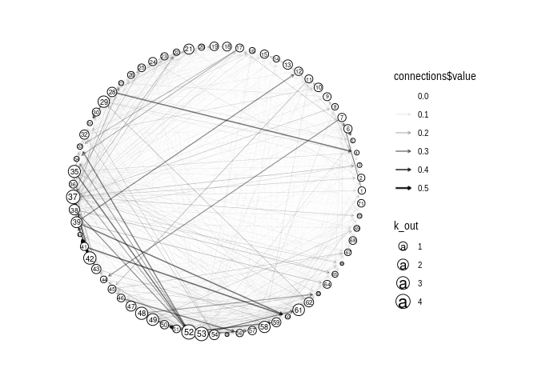

NetworkPlot
================

    ## [1] "library(readr)\nWw <- read_delim(\"./data/German/W2015.csv\", col_names = FALSE, delim=\";\")"

2015 German production network

    ## [1] "library(igraph)\nZ_igraph <- graph_from_adjacency_matrix(as.matrix(W), mode = \"directed\", weighted=TRUE)\n\n\nggraph(Z_igraph, layout = \"circle\") + geom_conn_bundle(data = get_con(from = connections$from, to = connections$to, col=connections$value), alpha = 0.1)  + geom_node_point() + coord_fixed() + scale_edge_color_continuous(low=\"skyblue\", high=\"darkviolet\")"

<!-- -->

    ## [1] "\nggraph(g, layout = \"circle\") + geom_edge_link(aes(width=connections$value, alpha=connections$value),arrow = arrow(length = unit(1, \"mm\")),end_cap = circle(2, \"mm\"))  + geom_node_point(aes(size=k_out), shape=21, fill=\"white\") + geom_node_text(aes(label=1:I, size=k_out/7))+ coord_fixed() + scale_edge_width(range=c(0.01,1)) + scale_edge_alpha(range = c(0.01, 1)) + theme_graph(background = \"white\")"
