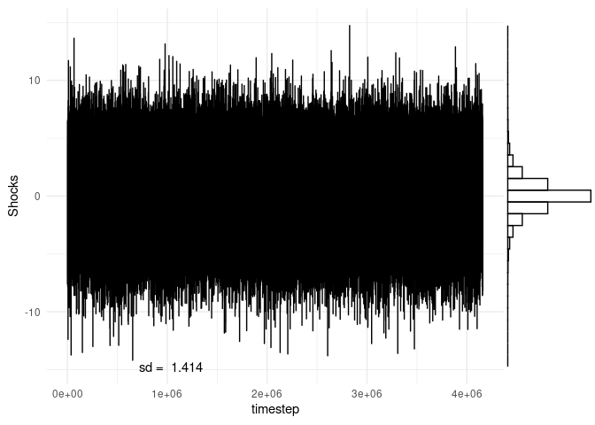
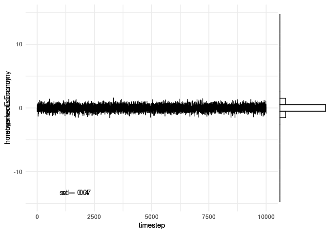
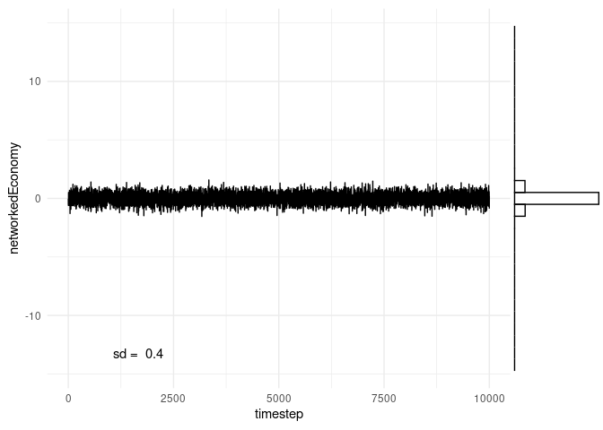
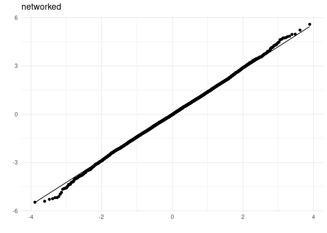
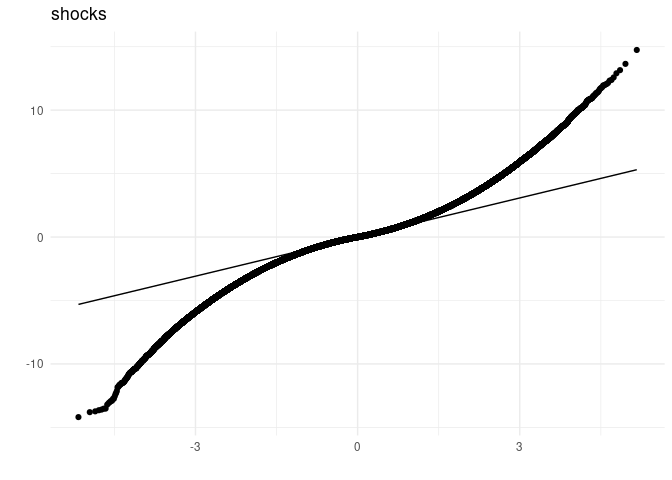
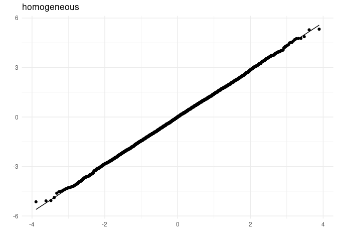

US-ShockSimulation
================

Domar weights v are calculated as $v = (I-(1-)W)^{-1} $

with *α* = 0.3333 (choice in Acemoglu(2012)).

Acemoglu (2017) calculate Domar weights of a networked economy in two
different ways. One is with sales data, dividing industries sales over
GDP. This is an empirical Domar weight. The other way is as in the above
equation. Instead of a normalised matrix W which is multiplied by
(1 − *α*) &lt; 1, the technical coefficient matrix is used to calculate
the Domar weight (This is in effect very close to using the normalised
matrix).

``` r
source("./code/1_3_readAndRunOutdegrees.R")
```

    ## 
    ## Attache Paket: 'dplyr'

    ## Die folgenden Objekte sind maskiert von 'package:stats':
    ## 
    ##     filter, lag

    ## Die folgenden Objekte sind maskiert von 'package:base':
    ## 
    ##     intersect, setdiff, setequal, union

``` r
'library(readr)
#W <- readrun_matrices("DE", 2015, bs=FALSE, "shocks")
W <- read_delim("./data/German/W2015.csv", delim = ";", col_names = FALSE)

#W <- CC %>% nesting_normalisingCCDFs(1,1,0, "shock")

# also read US and German output shares here
# for Germany needs total output in data
X2015 <- read_delim("./data/German/X2015.csv", delim = ";", col_names = FALSE)'
```

    ## [1] "library(readr)\n#W <- readrun_matrices(\"DE\", 2015, bs=FALSE, \"shocks\")\nW <- read_delim(\"./data/German/W2015.csv\", delim = \";\", col_names = FALSE)\n\n#W <- CC %>% nesting_normalisingCCDFs(1,1,0, \"shock\")\n\n# also read US and German output shares here\n# for Germany needs total output in data\nX2015 <- read_delim(\"./data/German/X2015.csv\", delim = \";\", col_names = FALSE)"

``` r
the_data <- readrun_matrices("US", "shock")

# for US??
source("./code/2_1_simulate_shocks.R")

shocked_Economies <- simulate_shocks(the_data[["2002"]], "laplace", n_shocks = 10^4)
```

    ## Lade nötiges Paket: MASS

    ## 
    ## Attache Paket: 'MASS'

    ## Das folgende Objekt ist maskiert 'package:dplyr':
    ## 
    ##     select

``` r
"laplace" # double exponential
```

    ## [1] "laplace"

### Comparison of shock volatility and aggregate volatilty in differently structured economies

All time series are plotted on the same interval of the y-axis to
illustrate how volatile aggregate output in different economies is in
comparison to shocks. As expected from the analytic statements,
volatility is smoothed strongest in the homogeneous economy. Volatility
doesn’t vanish so fast in the networked economy.

``` r
library(ggplot2)
library(ggExtra)
#library(ggridges)
# https://hydroecology.net/plotting-marginal-distributions-redux/
'ggplot(data= shocked_Economies$shock_output , aes(timestep, networkedEconomy)) + geom_line() + 
  geom_vridgeline(data = res.select, aes(group = time, width = ..density..), 
                  stat = "ydensity", scale = 5000, fill = NA, color = "blue", size = 1) '
```

    ## [1] "ggplot(data= shocked_Economies$shock_output , aes(timestep, networkedEconomy)) + geom_line() + \n  geom_vridgeline(data = res.select, aes(group = time, width = ..density..), \n                  stat = \"ydensity\", scale = 5000, fill = NA, color = \"blue\", size = 1) "

``` r
#ggplot(data=shocked_Economies$shock_output, aes(timestep, networkedEconomy)) + geom_point() + geom_line()

ylimits <- max(shocked_Economies$Shocks$Shocks)
p1 <- ggplot(data=shocked_Economies$Shocks, aes(timestep, Shocks)) + geom_point(alpha=0) + geom_line() + theme_minimal() + annotate("text", x = length(shocked_Economies$Shocks$Shocks) * (1/4), y = -ylimits, label =  paste("sd = ", round(sd(shocked_Economies$Shocks[["Shocks"]]), digits = 3))) + ylim(c(-ylimits,ylimits)) # suppress points, only show lines
ggMarginal(p1, margins="y", type = "histogram", fill=NA) #type="density"
```

<!-- -->

``` r
# https://stackoverflow.com/questions/60279826/add-marginal-density-plot-based-on-subset-of-plotted-data
# https://github.com/daattali/ggExtra/issues/109

'p2 <- ggplot(data=shocked_Economies$shock_output, aes(timestep, homogeneousEconomy)) + geom_point(alpha=0) + geom_line() + theme_minimal() + annotate("text", x = 90, y = -.4, label =  paste("sd = ", round(sd(shocked_Economies$shock_output[["homogeneousEconomy"]]), digits = 3))) + ylim(c(-4.1,4.1)) # suppress points, only show lines
ggMarginal(p2, margins="y", type = "histogram", fill=NA) #type="density"


p3 <- ggplot(data=shocked_Economies$shock_output, aes(timestep, networkedEconomy)) + geom_point(alpha=0) + geom_line() + theme_minimal() + annotate("text", x = 90, y = -1.4, label =  paste("sd = ", round(sd(shocked_Economies$shock_output[["networkedEconomy"]]), digits = 3))) + ylim(c(-4.1,4.1)) # suppress points, only show lines
ggMarginal(p3, margins="y", type = "histogram", fill=NA) #type="density"
'
```

    ## [1] "p2 <- ggplot(data=shocked_Economies$shock_output, aes(timestep, homogeneousEconomy)) + geom_point(alpha=0) + geom_line() + theme_minimal() + annotate(\"text\", x = 90, y = -.4, label =  paste(\"sd = \", round(sd(shocked_Economies$shock_output[[\"homogeneousEconomy\"]]), digits = 3))) + ylim(c(-4.1,4.1)) # suppress points, only show lines\nggMarginal(p2, margins=\"y\", type = \"histogram\", fill=NA) #type=\"density\"\n\n\n\np3 <- ggplot(data=shocked_Economies$shock_output, aes(timestep, networkedEconomy)) + geom_point(alpha=0) + geom_line() + theme_minimal() + annotate(\"text\", x = 90, y = -1.4, label =  paste(\"sd = \", round(sd(shocked_Economies$shock_output[[\"networkedEconomy\"]]), digits = 3))) + ylim(c(-4.1,4.1)) # suppress points, only show lines\nggMarginal(p3, margins=\"y\", type = \"histogram\", fill=NA) #type=\"density\"\n"

``` r
p1 <- ggplot(data=shocked_Economies$shock_output, aes(timestep, homogeneousEconomy)) + geom_point(alpha=0) + geom_line() + theme_minimal() + annotate("text", x = length(shocked_Economies$shock_output$timestep) * (1/6) , y = -ylimits*0.9, label =  paste("sd = ", round(sd(shocked_Economies$shock_output[["homogeneousEconomy"]]), digits = 3))) + ylim(c(-ylimits,ylimits)) # suppress points, only show lines
ggMarginal(p1, margins="y", type = "histogram", fill=NA) #type="density"


p2 <- ggplot(data=shocked_Economies$shock_output, aes(timestep, networkedEconomy)) + geom_point(alpha=0) + geom_line() + theme_minimal() + annotate("text", x = length(shocked_Economies$shock_output$timestep) * (1/6), y = -ylimits*0.9, label =  paste("sd = ", round(sd(shocked_Economies$shock_output[["networkedEconomy"]]), digits = 3))) + ylim(c(-ylimits,ylimits)) # suppress points, only show lines
ggMarginal(p2, margins="y", type = "histogram", fill=NA) #type="density"
```


Volatility of aggregate output in networked economy has decreased
compared to shocks but is higher than in homogenous economy. Due to the
law of large numbers, the more disaggregated the economy gets
(n\_sectors –&gt; ∞) the lower should be the volatility. With more
sectors, the aggregate output time series will center narrower and
narrower around the mean.

``` r
p1 <- ggplot(data=shocked_Economies$shock_output, aes(timestep, networkedEconomy)) + geom_point(alpha=0) + geom_line() + theme_minimal() + annotate("text", x = length(shocked_Economies$shock_output$timestep) * (1/6), y = -ylimits*0.9, label =  paste("sd = ", round(sd(shocked_Economies$shock_output[["networkedEconomy"]]), digits = 3))) + ylim(c(-ylimits,ylimits)) # suppress points, only show lines
ggMarginal(p1, margins="y", type = "histogram", fill=NA) #type="density"
```

<!-- -->

``` r
# https://stackoverflow.com/questions/60279826/add-marginal-density-plot-based-on-subset-of-plotted-data
# https://github.com/daattali/ggExtra/issues/109


# is it fat tailed? check CCDF
# QQ-plot
```

``` r
#-----
# CCDF
#-----

out_agg_sorted = sort(out_agg, decreasing = TRUE)
CCD = cumsum(out_agg_sorted)
prob = cumsum(1:n_shocks)
sum(out_agg)
plot(1:n_shocks, CCD)
plot(out_agg_sorted ,prob)
plot(log(out_agg_sorted), log(prob))

x = seq(from= -15, to = 15, length.out=1000)
CCDF_normal = sort(pnorm(x,mean(out_agg), sd(out_agg)), decreasing = TRUE)
plot(log(CCDF_normal),log(cumsum(1:1000)) , type = "l")
lines(log(CCDF_normal),log(cumsum(1:1000)))


# how does the tail of a normal cdf look like? plot also in picture
# https://stackoverflow.com/questions/59270647/how-to-plot-the-standard-normal-cdf-in-r
# https://stats.stackexchange.com/questions/26903/interpreting-the-difference-between-lognormal-and-power-law-distribution-networ
# https://demonstrations.wolfram.com/PowerLawTailsInLogNormalData/
# wolframalpha shrinks distribution further and further to tail

plot(pnorm(-5:10, mean=0, sd=4))
curve(pnorm, from = -5, to=2)
```

### Q-Q plots aggregate output US network economy and shocks

Why is aggregate output less normal distributed than shocks? Don’t
Acemoglu tell that normal shocks can not become fat tailed output? This
might be due to low shock sample size?

``` r
#fluctuations <- bind_cols(list(out_agg = out_agg, shocks = Shocks[1,]))

# * (1/shocked_Economies$euklidian_norm_v$networkedEconomy)
ggplot(data = shocked_Economies$shock_output, aes(sample=networkedEconomy* (1/shocked_Economies$euklidian_norm_v_tibble$networkedEconomy))) + geom_qq() + geom_qq_line() + theme_minimal() + ggtitle("networked") + xlab("") + ylab("")
ggplot(data = shocked_Economies$Shocks, aes(sample=Shocks)) + geom_qq() + geom_qq_line() + theme_minimal() + ggtitle("shocks") + xlab("") + ylab("")
```



### Q-Q plots aggregate output homogenous economy and shocks

``` r
# *(1/shocked_Economies$euklidian_norm_v$homogeneousEconomy)
ggplot(data = shocked_Economies$shock_output, aes(sample=homogeneousEconomy*(1/shocked_Economies$euklidian_norm_v_tibble$homogeneousEconomy))) + geom_qq() + geom_qq_line() + theme_minimal() + ggtitle("homogeneous") + xlab("") + ylab("")
ggplot(data = shocked_Economies$Shocks, aes(sample=Shocks)) + geom_qq() + geom_qq_line() + theme_minimal() + ggtitle("shocks") + xlab("") + ylab("")
```


