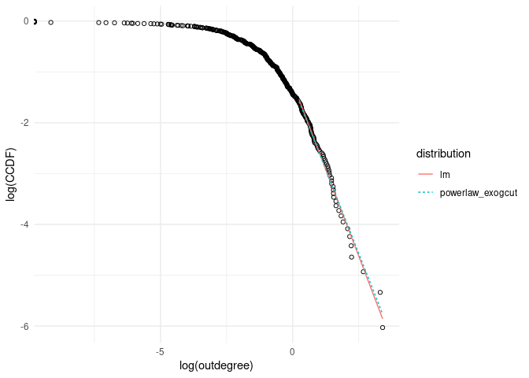

US first order outdegrees
================

Year: 1972, 1977, 1982, 1987, 1992, 1997, 2002

 

### Fitted distributions parameters

The following table contains the estimated slope of the tail with
different models. The standard error of the two linear regressions
differ so much because the corrected regression also uses an upward
corrected standard error. Also the p-value of a goodness-of-fit test via
bootstrapping for the powerlaw is reported. A high p-value indicates
that the distribution is a good fit to to the data.

    ## # A tibble: 35 × 6
    ##    year  distribution     parameter  xmin stderror p_value
    ##    <chr> <chr>                <dbl> <dbl>    <dbl>   <dbl>
    ##  1 1972  lm                    1.30    97   0.0135   NA   
    ##  2 1977  lm                    1.31   103   0.0123   NA   
    ##  3 1982  lm                    1.28   104   0.0111   NA   
    ##  4 1987  lm                    1.30   102   0.0129   NA   
    ##  5 1992  lm                    1.25    95   0.0155   NA   
    ##  6 1997  lm                    1.35    95   0.0178   NA   
    ##  7 2002  lm                    1.37    83   0.0169   NA   
    ##  8 1972  lm_GIcorrect          1.38    97   0.198    NA   
    ##  9 1977  lm_GIcorrect          1.39   103   0.193    NA   
    ## 10 1982  lm_GIcorrect          1.36   104   0.188    NA   
    ## 11 1987  lm_GIcorrect          1.37   102   0.192    NA   
    ## 12 1992  lm_GIcorrect          1.32    95   0.191    NA   
    ## 13 1997  lm_GIcorrect          1.43    95   0.208    NA   
    ## 14 2002  lm_GIcorrect          1.46    83   0.226    NA   
    ## 15 1972  ksr                   1.22    97  NA        NA   
    ## 16 1977  ksr                   1.27   103  NA        NA   
    ## 17 1982  ksr                   1.23   104  NA        NA   
    ## 18 1987  ksr                   1.24   102  NA        NA   
    ## 19 1992  ksr                   1.24    95  NA        NA   
    ## 20 1997  ksr                   1.23    95  NA        NA   
    ## 21 2002  ksr                   1.27    83  NA        NA   
    ## 22 1972  powerlaw              1.36    60  NA         0.46
    ## 23 1977  powerlaw              1.47    69  NA         0.35
    ## 24 1982  powerlaw              1.35    88  NA         0.44
    ## 25 1987  powerlaw              1.41    66  NA         0.68
    ## 26 1992  powerlaw              1.45    46  NA         0.53
    ## 27 1997  powerlaw              1.52    63  NA         0.34
    ## 28 2002  powerlaw              1.78    30  NA         0.75
    ## 29 1972  powerlaw_exogcut      1.21    97  NA         0.08
    ## 30 1977  powerlaw_exogcut      1.18   103  NA         0.08
    ## 31 1982  powerlaw_exogcut      1.28   104  NA         0.36
    ## 32 1987  powerlaw_exogcut      1.18   102  NA         0.32
    ## 33 1992  powerlaw_exogcut      1.12    95  NA         0.1 
    ## 34 1997  powerlaw_exogcut      1.10    95  NA         0.11
    ## 35 2002  powerlaw_exogcut      1.32    83  NA         0.31

GI corrected linear Regression outputs Acemoglu (2012):

    ## # A tibble: 2 × 8
    ##   parameter `1972` `1977` `1982` `1987` `1992` `1997` `2002`
    ##   <chr>      <dbl>  <dbl>  <dbl>  <dbl>  <dbl>  <dbl>  <dbl>
    ## 1 slope     -1.38  -1.38  -1.35  -1.37  -1.32  -1.43  -1.46 
    ## 2 stderror  -0.198 -0.190 -0.186 -0.192 -0.191 -0.208 -0.226

NW Kernel Regression slope Acemoglu (2012):

    ## # A tibble: 1 × 7
    ##   `1972` `1977` `1982` `1987` `1992` `1997` `2002`
    ##    <dbl>  <dbl>  <dbl>  <dbl>  <dbl>  <dbl>  <dbl>
    ## 1  -1.26  -1.29  -1.29  -1.29  -1.26  -1.26  -1.28

MLE power law outputs Acemoglu (2012):

    ## # A tibble: 3 × 8
    ##   parameter   `1972` `1977` `1982` `1987` `1992` `1997` `2002`
    ##   <chr>        <dbl>  <dbl>  <dbl>  <dbl>  <dbl>  <dbl>  <dbl>
    ## 1 slope        1.37   1.38   1.35   1.35   1.42   1.49   1.37 
    ## 2 stderror     0.153  0.163  0.150  0.163  0.211  0.189  0.152
    ## 3 tail-length 81     71     81     68     45     62     81

 

 

### Comparing GoF of alternative distributions to power law

P-values of the one sided likelihood ratio tests. The powerlaw of 2
different tail lengths is compared to the lognormal, weibull and
exponential distribution (each estimated with the tail length
corresponding to the powerlaw they are compared to). The p-value is the
probability of having the test statistic tending to one distribution if
actually the other distribution is a better fit. Thus the high p-values
for lognormal and weibull indicates that the tendency of the test
statistic to one distribution is not significant. The p-value for the
exponential distribution is low, therefore the positive test statistic
(1.9 and 1.6) tells that the powerlaw is a significantly better fit.

    ## # A tibble: 2 × 4
    ##   distribution     lognormal weibull exponential
    ##   <chr>                <dbl>   <dbl>       <dbl>
    ## 1 powerlaw             0.614   0.552      0.0352
    ## 2 powerlaw_exogcut     0.847   0.852      0.0328

    ## [1] 1.808778

    ## [1] 1.84053

P-values of two sided likelihood ratio tests. The p-values are the
probability of getting a positive or negative test statistic with this
value if actually no distribution fits better. The p-values for
lognormal and weibull are large, therefore the test can not distinguish
whether the power law or these distributions fit better. Because the
p-value for the exponential distribution is low, the positive test
statistic tells that the power law is a significantly better fit than
the exponential.

    ## # A tibble: 2 × 4
    ##   distribution     lognormal weibull exponential
    ##   <chr>                <dbl>   <dbl>       <dbl>
    ## 1 powerlaw             0.772   0.895      0.0705
    ## 2 powerlaw_exogcut     0.305   0.296      0.0657

 

### Empirical CCDF 2002 first order outdegrees

<!-- -->

 

 

### Plots of fitted distributions versus fitted power law (2002)

#### Linear Regression (left) and linear regression with GI correction (right) versus power law (20% tail)

 

 

#### Kernel Smoothing Regression and power law (20% tail)

<!-- -->

 

 

#### Exponential distribution and power law (20% tail, left, and optimal tail length, right)

 

 

#### Lognormal and weibull distribution versus power law (optimal tail length)

